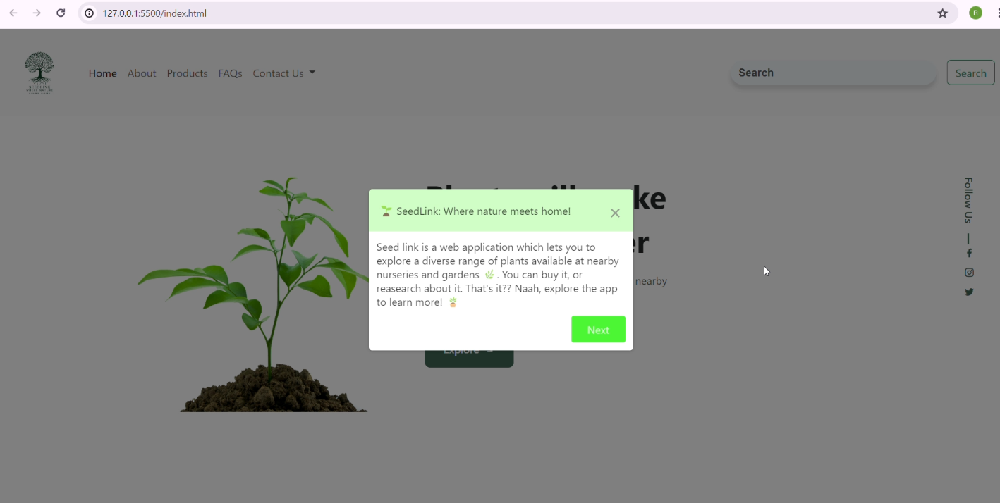
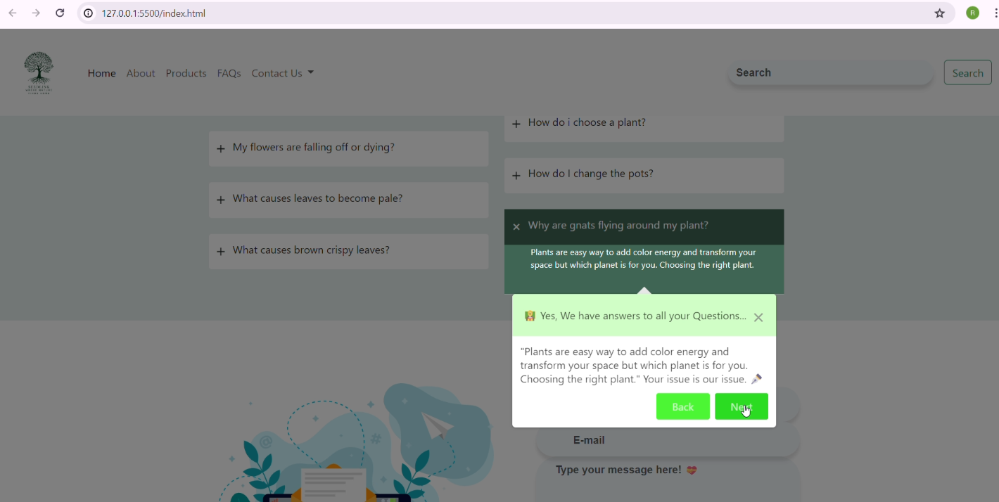
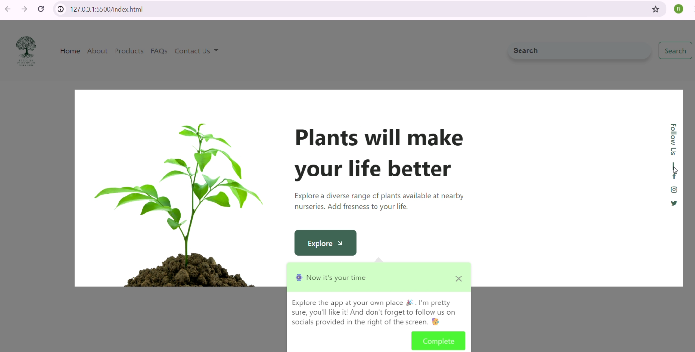
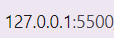
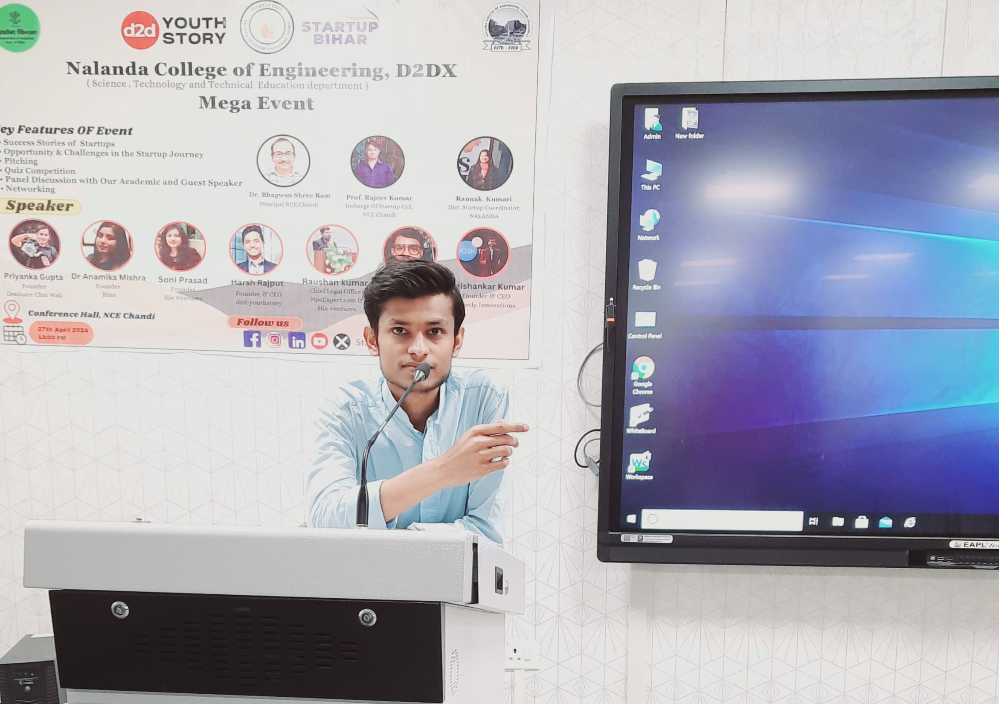

<p align="center">
    
</p>

#

<h1 align="center">
  SeedLink 🌱<br>
  <small>where nature meets home</small>
</h1>


<p align="center">
  
</p>

<br>

## 🌱 SeedLink  
 **SeedLink** is a web application which lets you to explore a diverse range of plants available at nearby nurseries and gardens 🌿. You can buy it, or reasearch about it. That's it?? Naah, explore the app to learn more! 🪴

<br>

## 🪶 Features
- SeedLink 🌱 will let you know about the plants, and the species, which you even don't know.
- You can search for your favourite plants in your nearby nursery by using SeedLink 🌱 search feature.
- You also be able to order your choosen plant, and the delivery will be done by our team!
- SeedLink 🌱 offers you a newsletter which keeps you updated about the plants.
- If you're finding our tough, we have a App Tour too! A guide which will help you to learn out app more!

#

## :books: Index

- [Demo](#movie_camera-Demo)
- [Screenshots](#screenshots)
- [Set Up](#outbox_tray-Set-up)
- [Contribute](#building_construction-Contribute)
- [Project Author](#people_holding_hands-Meet-the-Author)
- [Contact](#email-contact)

#

###  :movie_camera: Demo
- After a brief introduction, let's dive a little more inside the project.
- Here is the walk-through of **SeedLink 🌱**. If you want to witness a more a hd version, [click here](https://github.com/RS-labhub/SeedLink-Shepherd/blob/main/Preview/SeedLink.mp4)

https://github.com/RS-labhub/SeedLink-Shepherd/assets/117426013/eabee426-c90d-4996-a08b-d9826dbf4685

<p align="center">Video Demonstration</p>

### Screenshots

<p align="center">
  
  <p align="center">Tour Start</p>
  <br>
  <p align="center">
  
  <p align="center">Tour at some moment of time</p>
  <br>
  <p align="center">
  
  <p align="center">Tour end</p>
</p>

<br>


## Dependecies
1. **HTML**
2. *CSS*
3. **JavaScript**
4. *Bootstrap*
5. **Shepherd.js**

#

##  :outbox_tray: Installation Guide
- These are the steps required to install the python project:


1. Clone the Repository: Open a terminal or command prompt and clone the SeedLink 🌱 repository from GitHub using the following command:

  ```bash
    git clone https://github.com/RS-labhub/SeedLink-Shepherd.git
  ```

2. Navigate to the Repository Directory: Change your current directory to the cloned SeedLink 🌱 repository:

  ```bash
    cd SeedLink-Shepherd
  ```

3. Install Dependencies: Use pip to install the required Python dependencies listed in the requirements.txt file:

  ```bash
    pip install -r requirements.txt
  ```

4. Run SeedLink 🌱 application using the following command:

  ```py
    ctrl + shift + P
  ```

5. Once the application is running, take a tour.

<br>

> Note: The running port should look like this:
<p align="center">
  

<br>
<br>


## What to do after installation?
Once SeedLink 🌱 is installed and running, you can use it to get your wanted plants.


$~$

## Setup and Contributing Guidelines
    
**Set Up Your Environment**

1. `Fork` our repository to your GitHub account. 
2. `Clone` your fork to your local machine. 
    Use the command `git clone https://github.com/RS-labhub/SeedLink-Shepherd.git`.
3. Create a new branch for your work. 
    Use a descriptive name, like `fix-login-bug` or `add-user-profile-page`.
    
**Commit Your Changes**

- Commit your changes with a _clear commit message_. 
  e.g `git commit -m "Fix login bug by updating auth logic"`.

**Submit a Pull Request**

- Push your branch and changes to your fork on GitHub.
- Create a pull request, compare branches and submit.
- Provide a detailed description of what changes you've made and why. 
  Link the pull request to the issue it resolves. 🔗
    
**Review and Merge**

- I will review your pull request and provide feedback or request changes if necessary. 
- Once your pull request is approved, we will merge it into the main codebase 🥳

$~$

## :people_holding_hands: Meet the Author




### :email: Contact 
- Email: rs4101976@gmail.com
- Head over to my github handle from [here](https://github.com/RS-labhub)

<br>

<p align="center">
<a href="https://twitter.com/rrs00179" target="blank"></a>
<a href="https://www.linkedin.com/in/rohan-sharma-9386rs/" target="blank"></a>
</p>

<br>

<p align="center">
   Thank you for visting this Repo <br>If you like it, <a href="https://github.com/RS-labhub/I-Love-You/stargazers">star</a> ⭐ it
</p>
